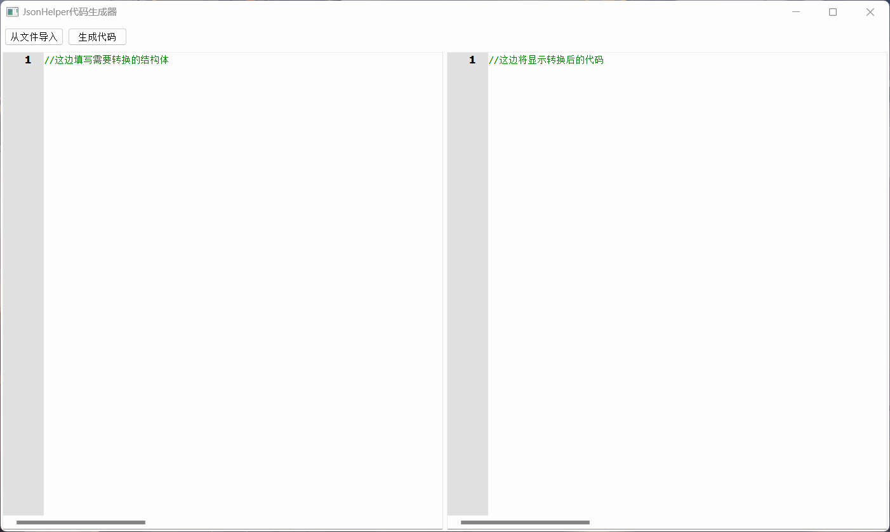

# QJsonHelper
qt数据对象的的json序列化和反序列化

# 目录说明
- JsonHelper.h 序列化和反序列化函数
- ObjJsonCode_Create 代码生成工具

# 使用方法
- 1.定义数据结构
```cpp
#include "JsonHelper.h"

class testStruct : public QObject
{
    Q_OBJECT
    Q_PROPERTY(int a READ READ_FUNC_NAME(a) WRITE WRITE_FUNC_NAME(a) CONSTANT)
public:
    testStruct &operator=(const testStruct& other)
    {
        if(this != &other)
        {
            this->a = other.a;
        }

        return *this;
    }
    int a;

protected:
    READ_WRITE_VALUE(int,a)
};

class myStruct : public QObject
{
    Q_OBJECT
    Q_PROPERTY(int id READ READ_FUNC_NAME(id) WRITE WRITE_FUNC_NAME(id) CONSTANT)
    Q_PROPERTY(QString name READ READ_FUNC_NAME(name) WRITE WRITE_FUNC_NAME(name) CONSTANT)
    Q_PROPERTY(QStringList nameList READ READ_FUNC_NAME(nameList) WRITE WRITE_FUNC_NAME(nameList) CONSTANT)
public:
    int id;
    QString name;
    QStringList nameList;
    testStruct _s1;

protected:
    READ_WRITE_VALUE(int,id)
    READ_WRITE_VALUE(QString,name)
    READ_WRITE_VALUE(QStringList,nameList)
    READ_OBJECT(_s1)
    WRITE_OBJECT(_s1)

};
```

- 2.在代码中使用
```cpp
void int main()
{
	testStruct _ss;
    _ss.a = 12;

    myStruct _t;
    _t.id = 1;
    _t.name = "小明";
    _t.nameList = QStringList({"zhangsan","lisi"});
    _t._s1 = _ss;

    auto _obj = objDump(&_t);
    qDebug() << _obj;

    myStruct _t1;
    objLoad(_obj,&_t1);

    qDebug() << _t1.id << _t1.name << _t1.nameList << _t1._s1.a;

	return 0;
}
```

# 使用生成工具生成代码

